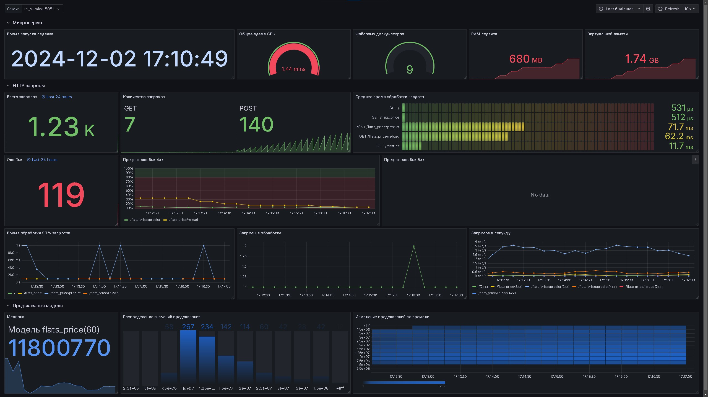

# Деплой модели в продакшен. 

Цель проекта — вывести готовую модель для оценки цен на недвижимость в продакшен. 

Полное описание проекта хранится в уроке «Проект. Релиз модели в продакшен» на учебной платформе. 

Здесь укажите имя вашего бакета: s3-student-mle-20240822-6db01ad632

## Микросервис

Микросервис расположен в директории `services\ml_service` и имеет следующую сруктуру:
```
    ml_service\
    | 
    ├── core
    |   ├── __init__.py
    |   ├── config.py       # Загрузка настроек сервиса
    |   └── monitoring.py   # Настройка и подключение мониторинга
    |
    ├── flats_price\        # Модуль модели предсказания квартир
    |   ├── __init__.py
    |   ├── handler.py      # Обработчик модели
    |   └── router.py       # Роутер FastAPI с описанием эндпоинтов и вызова обработчика
    |
    └── main.py             # Главный модуль с приложением FastAPI
```
Микросервис имеет модульную структуру, позволяющую удобно наращивать функционал дополнительными моделями.

## Сервисы мониторинга

Мониторинг подготовлен с использованием Prometheus и Grafana.

Настройки сервиса Prometheus располагаются в файле `services\prometheus\prometheus.yml`.

Сервис Grafana использует том Docker, содержимое которого расположено в директории `services\grafana`, 
что позволяет хранить настройки сервиса в директории проекта после его подготовки.

Подготовлен дашборд Grafana, который сохранен в файл `dashboard.json`.

Внешний вид дашборда:



## Запуск и остановка сервисов

Для запуска и остановки сервисов подготовлены Shell-скрипты в директории `services\`:

- `services\run_locally.sh` - запуск микросервиса локально.
- `services\run_service.sh` - запуск микросервиса в Docker.
- `services\stop_service.sh` - остановка микросервиса, запущенного в Docker.
- `services\run_compose.sh` - запуск всех сервисов посредством Docker compose.
- `services\stop_compose.sh` - остановка всех сервисов, запущенных посредством Docker compose.

## Тестирование микросервиса

Для тестирования микросервиса подготовлены Shell-скрипты в директории `testing\`:

- `testing\check_service.sh` - тестирование эндпоинтов проверки сервиса и загрузки модели.
- `testing\check_metrics.sh` - проверка эндпоинта с метриками `\metrics`.
- `testing\test_predict.sh` - разовая проверка предсказаний модели, значения для модели в файле `testing\test.json`.
- `testing\test_stress.sh` - нагрузочное тестирование различных эндпоинтов, в основном предсказания модели. 
Python-скрипт для тестирования расположен в файле `testing\test_stress.py`, значения для модели предсказания 
цены квартир расположены в файле `testing\test_stress.json`.

JSON файлы получены из исходного датасета, которые не использовались при обучении модели, 
получение и сохранение которых произведено в Jupyter ноутбуке `testing\load_test_data\test_data.ipynb`. 
