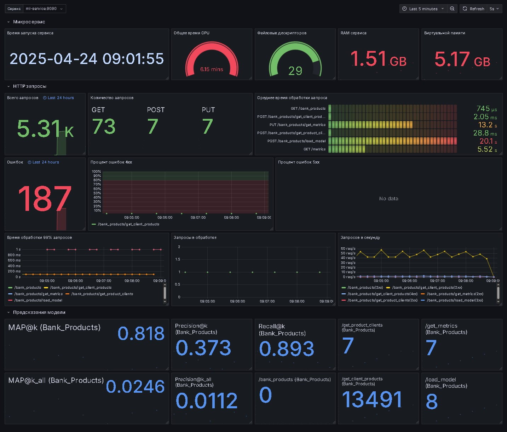

# Рекомендации банковских продуктов

**Бизнес задача**: Имеются данные о поведении клиентов банка за 1 год и 5 
месяцев — на их основе необходимо предсказать, какие новые продукты купят 
клиенты. Данные начинаются с 28 января 2015 года и содержат ежемесячные 
записи о продуктах, которыми воспользовался клиент, например, «кредитная 
карта», «сберегательный счет» и т. д. Необходимо предсказать, какие 
дополнительные продукты клиент получит в новом месяце. 

**Цель**: Подготовить модель машинного обучения, которая на имеющихся данных 
предскажет какими новыми банковскими продуктами воспользуется клиент в 
будущем месяце.

## 0. Подготовка окружения

Для работы рекомендуется создать и активировать виртуальное окружение Python 
выполнив следующие команды:

```sh
python3 -m venv .venv

source .venv/bin/activate
```

Для скачивания датасета предусмотрен скрипт 
[download_data.sh](download_data.sh):

```sh
./download_data.sh
```

Для просмотра Jupyter блокнотов запустите Jupyter Lab:

```sh
jupyter lab --ip=0.0.0.0 --no-browser
```

## 1. Исследование данных. 

В Jupyter блокноте [EDA.ipynb](EDA/EDA.ipynb) проведен глубокий 
исследовательский анализ данных:
- удалены все записи с пропусками по большинству полей, остальные пропуски 
заполнены на основании последующих значений у клиента, либо заглушками типа 
`unknown`;
- в датасете было выявлено большое количество аномалий, которые были 
исправлены;
- пропуски по доходу были заполнены нулями, так как нет понимания насколько 
актуальны эти сведения для старых клиентов, в датасете имеются 
несовершеннолетние и могут быть безработные, иждивенцы, либо находящиеся на 
социальном обеспечении клиенты. Также возможно не для всех продуктов 
запрашивались сведения по доходам и точно не запрашивались для резидентов 
других стран;
- выбросы были исправлены только по возрасту клиентов, так как при анализе 
признака, в том числе по банковским продуктам, имелись подозрения на наличие 
выбросов. 
Для этого была подготовлена регрессионная модель Random Forest и значения с 
самыми большими остатками были исправлены на предсказания модели;
- подготовлен трансформер для всех преобразований датасета.

## 2. Подготовка инфраструктуры. 

Для логирования артефактов и моделей, которые получены в результате 
исследований необходимо запустить платформу MLflow. Для этого подготовлен 
скрипт - [run-mlflow.sh](run-mlflow.sh)

```sh
./run-mlflow.sh
```

MLflow использует СУБД ProsgreSQL в качестве Backend Store, а также хранилище 
S3 Yandex Cloud в качестве Artifacts Store. Данные для подключения необходимо 
указать в .env файле, пример которого приведен в файле 
[.env_example](.env_example).


## 3. Трансляция. 

### Используемые метрики

Так как в постановке задачи не было конкретизировано, какие банковские 
продукты считать новыми - не использованные в текущий месяц, или за последний 
квартал/полугодие/год, было выбрано считать новыми продукты, которые не 
использовались в **текущем месяце**.

В целом поставленную задачу можно интерпретировать как задачу многометочной 
(multi-label) классификации, в том числе возможно разернуть продукты по 
клиентам а также дополнить признаками по продукту, например на базе ALS или 
другими эмбеддингами и решить задачу бинарной классификации. В таком случае 
могут подойти стандартные метрики классификации, такие как F1-score для 
баланса между точностью и полнотой, а также Precision, так как необходимо 
минимизировать ложноположительные предсказания.

Однако для рекомендации клиентам нескольких продуктов (в том числе 
multi-label), особенно если важен порядок рекомендаций, луче использовать 
метрику MAP@k (Mean Average Precision). 

Так как основная масса клиентов не пользуются новыми продуктами, а их 
количество для оставшихся клиентов обычно не превышает 3-х продуктов для 
более 99% клиентов, будет использовано `k=3`.

**Основная метрика**: MAP@3;

**Дополнительные метрики**: Precision@3, Recall@3 для дополнительной оценки 
рекомендаций.

### Подход к решению задачи

Для решения задачи планируется произвести сравнение двух моделей машинного 
обучения:
1. Модель рекоммендаций с применением двухстадийного подхода на базе 
коллаборативной фильтрации ALS и ранжирования полученных рекомендаций 
классификатором на основе градиентного бустинга CatBoost.
2. Модель Multi-label классификации для ранжирования продуктов.

Разделение датасета решено произвести на 3 разных по размеру выборки:
1. Тренировочная выборка - весь 2015 год, записи из которой будут 
использоваться для коллаборативной фильтрации;
2. Валидационная выборка - первый квартал 2016 года, записи из которой будут 
применяться для обучения модели ранжирования в двухстадийном подходе, либо 
для валидации модели Multi-label классификации;
3. Тестовая выборка - последний месяц в датасете.

## 4. Моделирование. 

Проведено сравнение двух baseline-моделей:
1. Модель с двухстадийным подходом (ALS + CatBoost);
2. Многометочная (multi-label) модель (CatBoost).

Метрики расчитывались как для всех клиентов, так и 
для клиентов с новыми продуктами:
1. Все клиенты (включая клиентов без новых продуктов)

| Метрика         | ALS+CatBoost | CatBoost   | Прирост (%) |
|:----------------|-------------:|-----------:|------------:|
| MAP@3_all       | 0.0182       | 0.0246     | +34.9%      |
| Precision@3_all | 0.0088       | 0.0113     | +27.9%      |

2. Клиенты с новыми продуктами:

| Метрика     | ALS+CatBoost | CatBoost   | Прирост (%) |
|:------------|-------------:|-----------:|------------:|
| MAP@3       | 0.6074       | 0.8200     | +35.0%      |
| Precision@3 | 0.2936       | 0.3753     | +27.8%      |
| Recall@3    | 0.7232       | 0.8943     | +23.7%      |

Во всех метриках multi-label CatBoost дает прирост от ~24% до ~35%, что 
является весьма существенным. 

Дополнительно проиведена стратификация минорных признаков, отбор признаков 
решено не производить, а для подбора гиперпараметров модели необходимо 
увеличение вычислительных ресурсов и оперативной памяти. 

Все модели логированы в MLflow. Лучшая модель переведена в стадию `Production` 
для использования сервисом рекомендаций.

Эксперименты с моделями проводились в Jupyter блокноте 
[modeling.ipynb](modeling.ipynb), также подготовлен объединенный с EDA блокнот 
[bank_products.ipynb](bank_products.ipynb).

## 5. Продуктивизация. 

Подготовлен FastAPI Веб-сервис в директории `ml_service`, который представлен 
модульной структурой следующего вида:

    ml_service\
    |
    ├── bank_products\          # Модуль банковских рекомендаций
    |   ├── __init__.py
    |   ├── service.py          # Обработчик модели
    |   └── router.py           # Роутер FastAPI с эндпоинтами
    |
    ├── settings\               # Директория для настроек
    |   ├── __init__.py
    |   └── bp_settings.yaml    # Настройки банковских рекомендаций
    |
    ├── config.py               # Настройки сервиса
    ├── main.py                 # Главный модуль FastAPI
    └── monitoring.py           # Настройка мониторинга

Структура позволяет наращивать функциональность добавлением модулей, файлы 
настроек располагаются в директории `settings\`.

Сервис банковских рекомендаций доступен по маршруту `/bank_products` и 
содержит следующие эндпоинты:
1. GET `/bank_products/` - возвращает статус модели;
2. POST `/bank_products/load_model` - загружает модель из MLflow, а также 
датасет из S3 за последний месяц. Данные для загрузки передаются в теле 
запроса в формате JSON. Необходимо передать следующие параметры:
    - S3 URL файла с данными за месяц;
    - Pandas storage_options для скачивания файла с данными;
    - Имя модели в MLflow;
    - MLflow flavor для модели;
    - Адрес трекинг сервера MLflow;
    - Этап модели MLflow (Production/Staging)

    При передаче пустого JSON используются первоначальные данные о модели из 
    переменных окружения.
    
    Загружается последняя версия модели на указанном этапе. Проводится 
    тестирование датасета путем получения предсказаний. Предсказания 
    исползуются для предоставления сведений о клиенте по продукту.

2. POST `/bank_products/get_product_clients` - предоставляет список клиентов, 
у которых вероятность использования продукта в следующем месяце превышает 
порог. Принимает следующие параметры:
    - Кодовое наименование продукта;
    - Порог (значение по умолчанию берется из переменных окружения);
    - Степень округления вероятности, по умолчанию 2;

    Возвращает id клиента с вероятностью не ниже порога.

2. POST `/bank_products/get_client_products` - предоставляет ТОП-k продуктов, 
которые клиент с наибольшей вероятностью приобретет в следующем месяце. 
Принмает следующие параметры:
    - Идентификатор клиента;
    - Значение top_k, по умолчанию берется из переменных окружения.

    Возвращает кодовые наименования продуктов и вероятность их использования 
    клиентом.

2. PUT `/bank_products/get_metrics` - расчитывает метрики модели на основании 
предоставленных сведений об использовании новых продуктов в новом месяце. 
Принимает сведения об использовании подуктов клиентами в JSON формате вида: 

```json
{
    "client1_id": [1, 0, 0, "...", 0, 1, 0],
    "...",
    "clientn_id": [0, 1, 0, "...", 0, 0, 1]
}
```

> Крайне важно направлять данные об использовании продуктов в той же 
последовательности, в которой они были расположены при обучении модели. 
> 
> В файле настроек сервиса имеются сведения о кодовых наименованиях столбцов 
в правильном порядке.

Для локального запуска сервиса подготовлен shell скрипт 
[run-service](run-service.sh).

```sh
./run-service.sh
```

> Перед запуском сервиса локально необходимо добавить > в файл `/etc/hosts` 
> запись `mlflow-server` по локальному адресу `127.0.0.1` или исправить адрес 
> сервера MLflow для модели в переменной окружения `BP_TRACKING_URI`

Для удобства деплоя Веб-сервиса подготовлен файл `Dockerfile_ml_service`, а 
также файл параметров Docker compose для запуска Веб-сервиса с системой 
мониторинга, а также shell скрипт для их запуска:

```sh
./run-docker.sh
```

> В файл `docker-compose.yaml` в целях доступа к > локальному серверу MLflow 
> добавлена ссылка на хост-машину, при деплое необходимо исключить запись 
> `extra_hosts` и в переменной окружения указать корректный сервер MLflow.

Для остановки docker образова необходимо в корневой директории проекта 
выполнить команду:

```sh
docker compose down
```

Веб-сервис позволяет:
    - Загружать новую версию модели посредством MLflow в течение месяца; 
    - Получать список клиентов по вероятности использования новых продуктов 
    в новом месяце для организации каких-нибудь маркетинговых кампаний; 
    - Получать наиболее вероятные продукты, которыми клиент может 
    воспользоваться, для его дополнительного стимулирования, например, в 
    случае внезапного контакта, такого как обращение в службу поддержки или 
    менеджеру по работе с клиентами;
    - расчитать метрики модели по неполным сведениям о взаимодействиях в любое 
    время в течении нового месяца.

## 6. Тестирование

Для тестирования Веб-сервиса подготовлен Python скрипт 
[testing/test.py](testing/test.py). Для запуска тестирования необходимо 
перейти в директорию и запустить `python3 test.py`, также подготовлен 
Shell скрипт для запуска тестирования из корневой директории: 

```sh
./run-test.sh
```

Скрипт тестирования производит следующие действия: 
1. Проверка доступности Веб-сервиса. В случае его недоступности предлагает 
повторить проверку, либо завершить выполнение скрипта.
2. Тестирование Веб-сервиса выполняется в разрезе ТОП-7 самых популярных 
продуктов:
    - 1 запрос списка клиентов для одного из ТОП продуктов со случайным 
    порогом вероятности от 0.5 до 0.8; 
    - 2000 запросов на получение ТОП (от 3 до 7) продуктов для случайных 
    клиентов, в том числе которых нет в датасете для имитации ошибок в 
    запросах к сервису;
    - 1 запрос на расчет метрик для случайных клиентов по всему датасету;
    - 1 запрос на перезагрузку модели для имитации изменения модели 
    (загружается та же модель);
3. По окончании тестирования по ТОП-7 продуктов с добавлением дополнительных 
запросов по другим функциям, производится расчет метрик по всему датасету.

## 7. Мониторинг. 

Мониторинг Веб-сервиса реализован посредством сервисов Grafana и Prometheus. 
Описание метрик и реализации мониторинга представлено в файле 
[monitoring/README.md](monitoring/README.md).

Для мониторинга подготовлен дашборд в Grafana, внешний вид дашборда:


